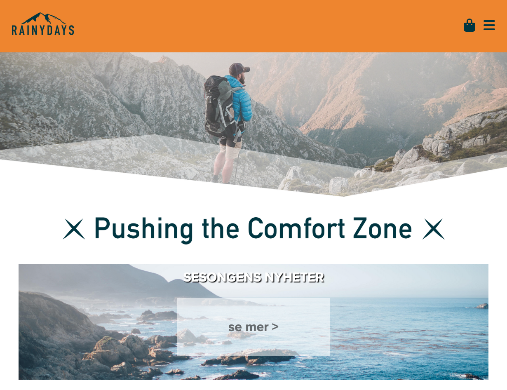

# <a href="https://rydlande.github.io/Semester_Project_1/">Cross-course project</a>

This site is my cross-course project for my two first semesters at Noroff School of Technology.

## Description

The cross-course task was to create an online store that sells rain jackets for men and women. The slogan was "pushing the comfort zone" and the target audience was men and women aged 30 to 50 whose interests are: being outdoors, hiking, exploring, skiing, camping, canoeing.

I did not have the opportunity to finish all the course assignment related to this project, that is why I have only used HTML and CSS for this project.

## Technologies Used

<ul>
    <li>HTML5</li>
    <li>CSS</li>
</ul>

## Running

To view the page, copy this link:

    https://rydlande.github.io/Cross-course_project/

## Contact

<a href="https://www.linkedin.com/in/eirin-rydland-944b49210">My LinkedIn page</a>

## Acknowledgments

Thank to my teacher, Jon, for learning me how to write code.
